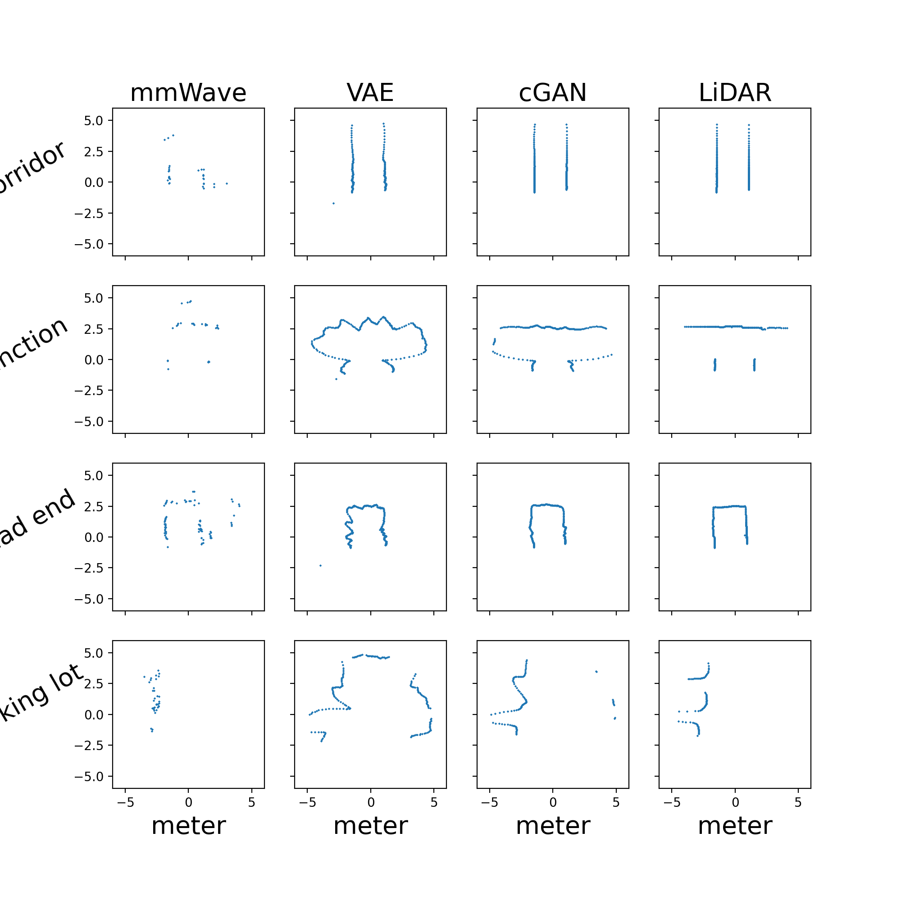
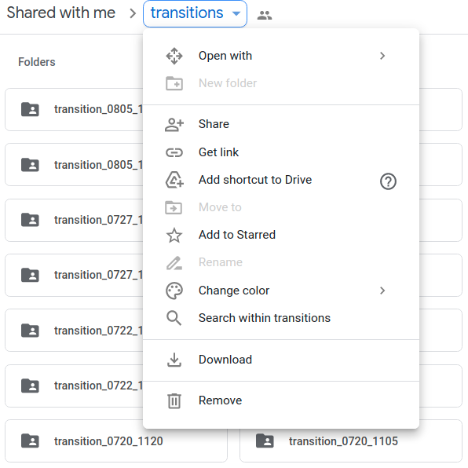
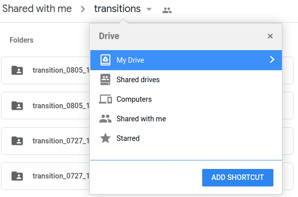
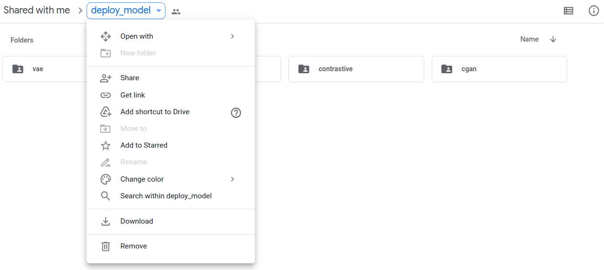
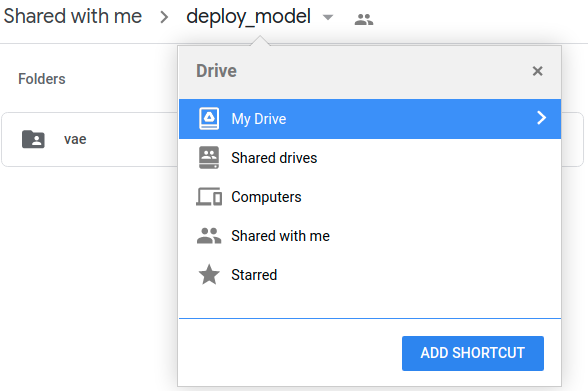

# Enabling Learning-based Navigation in Obscurants with Lightweight, Low-cost Millimeter Wave Radar Using Cross-modal Contrastive Learning of Representations

## Intro
This repo demonstrate using generative model to reconstruct mmWave radar range data to dense range data closer to LiDAR ground truth.

The reconstructed range data can be used as signals for control policys.
Futher details please refer to our [website](https://ARG-NCTU.github.io/projects/deeprl-mmWave.html).

## Dataset
[dataset on our google drive](https://drive.google.com/drive/u/0/folders/1FMkjvJl070_LxqcNBFeBedPsZFoy0VNe)

To run the inference model on colab. Please create a short cut of the dataset to your own google drive

## inference model
[pretrained model on our google drive](https://drive.google.com/drive/u/2/folders/1oz7vF7SROx8Q85B1cLGpNItQHwsZkCKr)

To run the inference model on colab. Please also create a short cut of pretrained models to your own google drive

## run colab
- cGAN generate
    - 

- VAE generate
    - 

